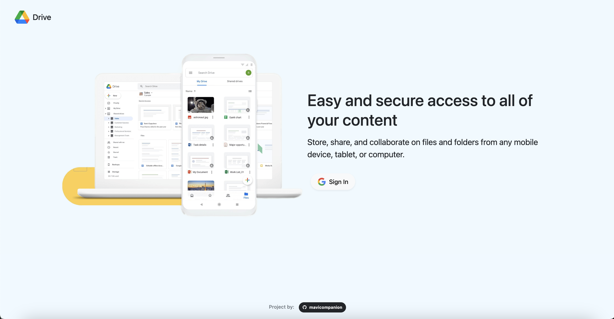
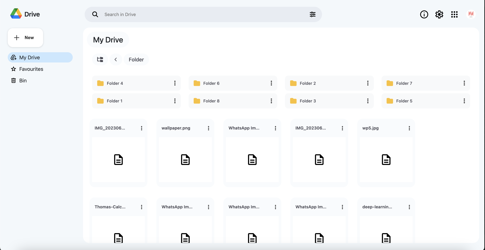

# Google Drive Clone

A **Google Drive Clone** built using **HTML**, **CSS**, **JavaScript**, and **Firebase** for authentication and file storage. This application allows users to securely log in, upload files, create folders, and manage their data just like Google Drive.

---

## Features

- 🔐 **Authentication**: User login and registration with Firebase Authentication.
- 🗃️ **File Storage**: Upload and manage files using Firebase Storage.
- 📂 **Folder Creation**: Organize files with a folder structure.
- 🔄 **Real-Time Updates**: Any file changes are reflected instantly.
- 🔍 **Search**: Search for specific files or folders.
- 🖼️ **Preview Files**: Preview images and access file metadata.

---

## Demo

🚀 Check out the [Live Demo](https://google-drive-clone-vrc.vercel.app/)(replace with your actual demo link)

---

---

## Tech Stack

- **Frontend**: HTML, CSS, JavaScript
- **Backend**: Firebase (Authentication, Firestore, Storage)

---

## Firebase Setup

To run this project locally, you'll need to configure Firebase for authentication and storage.

1. Create a new project on [Firebase Console](https://console.firebase.google.com/).
2. Enable **Firebase Authentication** and **Firebase Storage**.
3. Download your Firebase configuration and add it to the project.

In your `firebase.js` file, initialize Firebase like this:

```js
// Import Firebase SDK
import { initializeApp } from "firebase/app";
import { getAuth } from "firebase/auth";
import { getStorage } from "firebase/storage";

// Your Firebase config
const firebaseConfig = {
  apiKey: "YOUR_API_KEY",
  authDomain: "YOUR_PROJECT_ID.firebaseapp.com",
  projectId: "YOUR_PROJECT_ID",
  storageBucket: "YOUR_PROJECT_ID.appspot.com",
  messagingSenderId: "YOUR_MESSAGING_SENDER_ID",
  appId: "YOUR_APP_ID"
};

// Initialize Firebase
const app = initializeApp(firebaseConfig);
const auth = getAuth(app);
const storage = getStorage(app);
```

# To clone the repo

git clone https://github.com/yourusername/google-drive-clone.git


# Snapshots of Project UI



